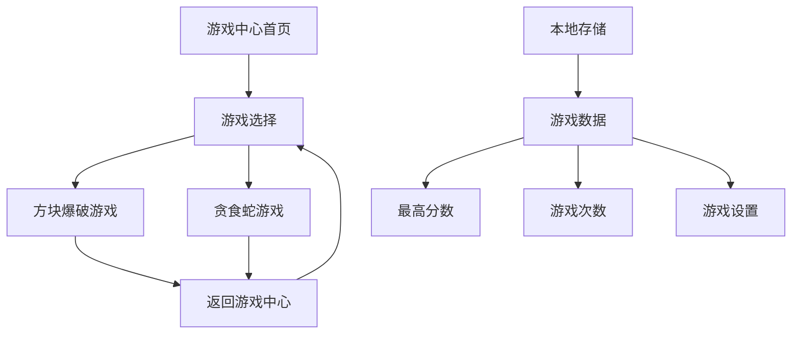

# Index.html 完成计划

## 当前状态分析

### 文件概述
- **文件名**: index.html
- **当前大小**: 1071 行
- **状态**: 文件被截断，需要完成
- **功能**: 游戏中心，集成方块爆破和贪食蛇游戏

### 已实现功能
1. ✅ 完整的 HTML 结构和 CSS 样式
2. ✅ 游戏中心界面设计
3. ✅ 游戏选择卡片（方块爆破和贪食蛇）
4. ✅ 游戏数据显示区域
5. ✅ 游戏展示区域框架
6. ✅ 游戏中心信息区域
7. ✅ 页脚
8. ✅ 基本的 JavaScript 游戏中心逻辑
9. ✅ 本地存储数据管理
10. ✅ 游戏切换功能

### 发现的问题

#### 1. 文件截断问题
- 文件在第 1071 行被截断
- `updateSnakeGameStats` 函数不完整
- 缺少脚本结束标签和 HTML 结束标签

#### 2. 缺失的游戏逻辑
- `BlockGame` 和 `SnakeGame` 对象只有占位符实现
- 需要从 `block.html` 和 `snake.html` 提取完整的游戏逻辑
- 游戏画布交互逻辑缺失

#### 3. 事件绑定不完整
- 游戏控制按钮事件需要完善
- 返回游戏中心功能需要测试
- 游戏暂停/继续逻辑需要实现

## 需要完成的任务

### 任务 1: 修复文件截断
**位置**: 第 1069-1071 行
```javascript
updateSnakeGameStats: function(score, length) {
    if (score > this.games.snake.highScore) {
        this.games.s
```
**需要完成为**:
```javascript
updateSnakeGameStats: function(score, length) {
    if (score > this.games.snake.highScore) {
        this.games.snake.highScore = score;
    }
    if (length > this.games.snake.maxLength) {
        this.games.snake.maxLength = length;
    }
    this.saveGameData();
    this.updateGameStatsDisplay();
},
```

### 任务 2: 添加缺失的脚本结束部分
在 `updateSnakeGameStats` 函数后需要添加:
1. `init` 方法的完整实现
2. `BlockGame` 和 `SnakeGame` 对象的完整实现
3. 游戏中心初始化调用
4. 脚本结束标签 `</script>`
5. HTML 结束标签 `</body></html>`

### 任务 3: 集成游戏逻辑
从 `block.html` 提取:
1. 画布初始化
2. 挡板和球物理
3. 方块碰撞检测
4. 能量提升系统
5. 关卡系统
6. 分数计算

从 `snake.html` 提取:
1. 蛇移动算法
2. 食物生成逻辑
3. 碰撞检测
4. 难度选择
5. 分数系统

### 任务 4: 完善事件处理
需要实现的事件:
1. 游戏开始/暂停/重新开始按钮
2. 返回游戏中心按钮
3. 键盘控制（方向键、空格键）
4. 触摸/鼠标控制
5. 游戏结束处理

### 任务 5: 测试和验证
1. 验证 HTML 结构完整性
2. 测试游戏切换功能
3. 测试数据保存/加载
4. 测试游戏逻辑
5. 跨浏览器兼容性测试

## 技术实现细节

### 游戏中心架构


### 数据流
1. 用户选择游戏 → 加载游戏界面
2. 游戏进行 → 更新分数/状态
3. 游戏结束 → 保存数据到本地存储
4. 返回游戏中心 → 更新显示数据

### 文件结构整合
```
index.html (主文件)
├── CSS 样式 (内联)
├── HTML 结构
└── JavaScript
    ├── 游戏中心管理器
    ├── 方块爆破游戏逻辑 (从 block.html 提取)
    └── 贪食蛇游戏逻辑 (从 snake.html 提取)
```

## 实施步骤

### 阶段 1: 基础修复
1. 修复文件截断问题
2. 添加缺失的结束标签
3. 验证 HTML 结构完整性

### 阶段 2: 游戏逻辑集成
1. 分析 block.html 的游戏逻辑
2. 分析 snake.html 的游戏逻辑
3. 提取核心游戏函数
4. 集成到游戏中心架构中

### 阶段 3: 事件系统完善
1. 实现按钮事件处理
2. 添加键盘控制
3. 实现触摸/鼠标控制
4. 添加游戏状态管理

### 阶段 4: 测试和优化
1. 功能测试
2. 性能测试
3. 用户体验优化
4. 错误处理完善

## 风险评估

### 技术风险
1. **游戏逻辑冲突**: 两个游戏的 JavaScript 可能有命名冲突
   - **缓解**: 使用命名空间或模块模式
   
2. **性能问题**: 内联大量 JavaScript 可能影响加载速度
   - **缓解**: 考虑将游戏逻辑分离到外部文件

3. **浏览器兼容性**: Canvas 和本地存储的兼容性问题
   - **缓解**: 添加特性检测和回退方案

### 时间风险
1. **游戏逻辑提取**: 可能需要详细分析现有代码
2. **集成测试**: 需要充分测试游戏切换和数据保存

## 成功标准

1. ✅ 文件完整无截断
2. ✅ 所有游戏功能正常工作
3. ✅ 数据保存和加载正常
4. ✅ 游戏切换流畅
5. ✅ 用户界面响应迅速
6. ✅ 无 JavaScript 错误

## 下一步行动

建议切换到 **Code 模式** 执行以下任务:
1. 修复文件截断问题
2. 集成游戏逻辑
3. 完善事件处理
4. 进行功能测试

## 参考资料
1. `block.html` - 方块爆破游戏完整实现
2. `snake.html` - 贪食蛇游戏完整实现
3. `plans/game_center_fusion_plan.md` - 游戏中心融合方案
4. `PRD.md` - 产品需求文档
5. `UI-PRD.md` - 用户界面需求文档